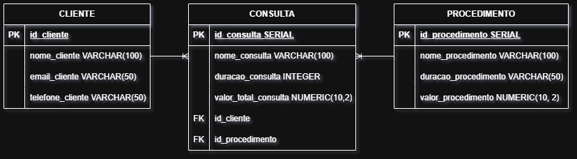

# Sorriso Metálico
**Qual é o cliente deste repositório específico?**\
O dentista Roberto.

**Qual o objetivo do sistema dele?**\
Um sistema de gestão de atendimentos de uma clínica odontológica.

**CLIENTE:** 1 cliente para N consultas (1:N).\
**CONSULTA:** N consultas para 1 procedimento (1:N).
